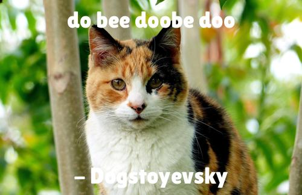

# Motivational Puppy Meme Generator

## The base of this project as well as the below gif are from: Udacity - Intermediate Python Nanodegree


## Project Overview
This Project is a Meme Generator that can be used through the command line or a web application.
It can create pictures like this:



## Instructions for setting up and running the program
### Setup
For running the program you need certain python dependencies. You can check them in requirements.txt or install all of them through:
```sh
$ pip install -r requirements.txt
```
You also need the external application pdftotext.
> TIP: pdftotext may not be installed on your local machine (Mac or Windows). If this is the case, you can install using the open source [XpdfReader utility](https://www.xpdfreader.com/pdftotext-man.html).

### Running
* Generate a meme on the command line
```sh
$ python3 src/meme.py
```

* Run in your browser
```sh
$ python3 src/app.py
```

## Description of the roles-and-responsibilities of all sub-modules
#### Quote Engine Module
The Quote Engine Module imports Quotes and Authors from a variety of filetypes through dedicated Ingestors and stores them in a standardized Format (QuoteModel).

#### Meme Engine Module

The Meme Engine Module is responsible for manipulating and drawing text onto images.
Given a path to and image, a quote and an author it will draw the latter two on the image and save it. 

#### Command Line Interface tool

The project contains a simple cli app to generate Memes in `meme.py`. 
The script takes three _optional_ CLI arguments:

- `--body` a string quote body
- `--author` a string quote author
- `--path` an image path

The script returns a path to a generated image.
If any argument is not defined, a random selection is used.

#### The Flask app

The project contains a flask app in `app.py`. 
The app uses the Quote Engine Module and Meme Generator Modules to generate a random captioned image. Alternatively a Meme can be generated by the user by giving the link to an image on the internet, a quote and an author.